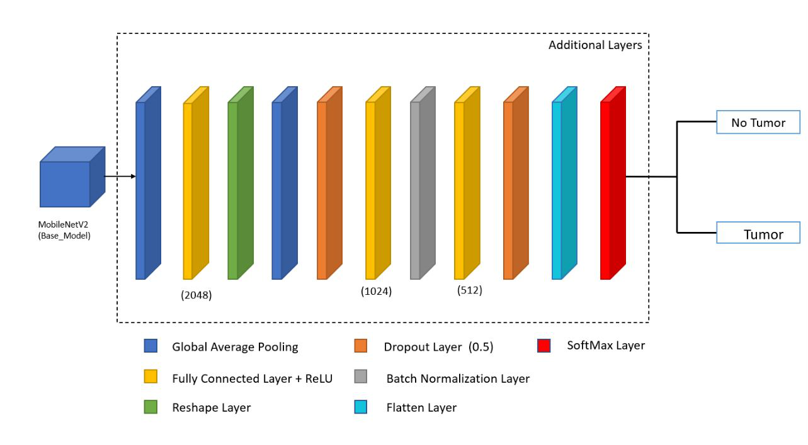

# ✨ Klasifikasi Otomatis Jenis Ternak Sapi dengan ResNet50 dan MobileNetV2 ✨

  

## Deskripsi Proyek

Proyek ini bertujuan untuk mengembangkan model pembelajaran mesin yang mampu mengklasifikasikan jenis sapi berdasarkan fitur-fitur tertentu. Proyek ini dirancang untuk membantu peternak, peneliti, dan pihak terkait dalam mengidentifikasi jenis sapi dengan lebih cepat dan akurat, sehingga dapat mendukung pengambilan keputusan dalam pengelolaan peternakan, pemuliaan, dan pemasaran ternak.

**Link Dataset yang digunakan:** [Cow Breed Classification Dataset](https://www.kaggle.com/datasets/zaidworks0508/cow-breed-classification-dataset).
Preprocessing yang digunakan antara lain Resizing, Normalization dan Augmentation.

Model yang digunakan: Pre Trained Model **_InceptionV3_** dan Pre Trained Model **_MobileNetV2_** dengan Architecture Model kurang lebih seperti gambar berikut.

**InceptionV3 Architecture** ✨

**MobileNetV2 Architecture** ✨

## Overview Dataset

Dataset yang digunakan adalah Dataset citra sapi. Dataset terdiri atas 2.167 data yang terbagi menjadi 70% sebagai Training Set, 20% sebagai Validation Set, dan 10% sebagai Testing Set, dimana pada setiap Set, terdapat 8 Label Class yaitu 'brahman', 'cholistani', 'dhani', 'fresian', 'kankarej', 'sahiwal', 'sibbi', 'unidentified (mixed)'.

## Langkah Instalasi

a. Model

1. Unduh Dataset yang akan digunakan
2. Run Script Settings To Extracted Dataset (Script.ipynb)
3. Run IPYNB
4. Save Kedua Model

b. Streamlit

1. Pdm add streamlit scikit-learn

install tensorflow dipdm
2. Pdm info -> pastikan sudah berada di .venv
3. Pdm run python -m pip show tensorflow -> cek tensorflow apakah sudah di .venv
4. Pdm run python -m ensurepip --upgrade
5. Pdm run python -m pip install tensorflow
6. Pdm run python -c "import tensorflow as tf; print(tf._version_)"

c. Deploy Streamlit Model

1. Upload All File Diluar Environtment PDM (.gitignore)
2. Deploy dan Bake melalui streamlit dengan terhubung dengan github[Dokumentasi Streamlit](https://docs.streamlit.io/)
3. Run dengan address deployment dengan akhiran **.io**

## Deskripsi : Model, Hasil, Analisis
**Preprocessing**

- Generator training menggunakan ImageDataGenerator untuk memuat dan memproses gambar dari direktori yang ditentukan.
- Gambar diubah ukurannya menjadi 224x224 piksel dengan batch size 64.
- Augmentasi data diterapkan pada gambar training dengan langkah-langkah berikut:
    - Zoom 
    - Translasi
    - Brightness
    - Contrast
- Konfigurasi ini memungkinkan model untuk belajar dari berbagai variasi gambar selama training, sementara preprocessing untuk evaluasi tetap konsisten.

InceptionV3: Modelling & Evaluation ✨
Model ini menggunakan InceptionV3 sebagai base model yang telah dilatih dengan ImageNet dan dibekukan untuk tahap awal transfer learning. Arsitektur ini ditambahkan lapisan kustom seperti Global Average Pooling, Batch Normalization, beberapa lapisan dense dengan aktivasi ReLU, dan Dropout untuk mencegah overfitting. Lapisan output memiliki jumlah unit sesuai dengan jumlah kelas yang ingin diklasifikasikan menggunakan fungsi aktivasi Softmax.

Total parameter: 23,851,784, dengan 536,960 parameter dapat dilatih. Konfigurasi ini memanfaatkan keunggulan InceptionV3 untuk ekstraksi fitur dan lapisan tambahan dilatih untuk klasifikasi yang lebih spesifik.

Berikut hasil dari Model setelah dilakukan Fine-Tuning menggunakan dataset : 

