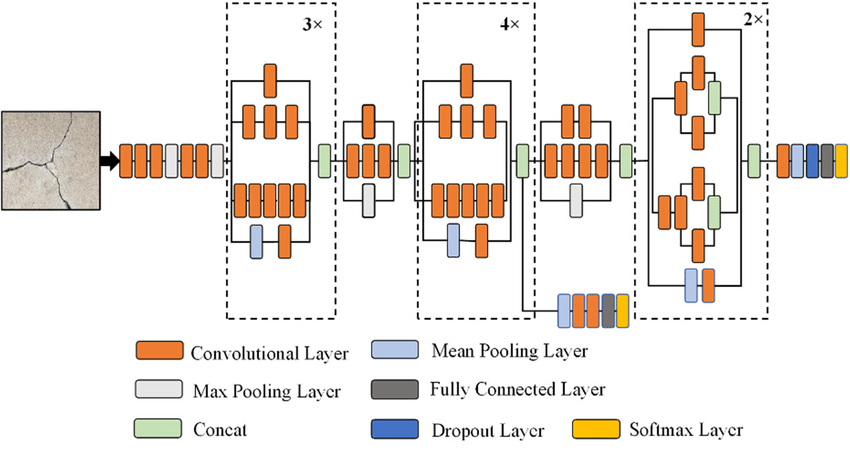
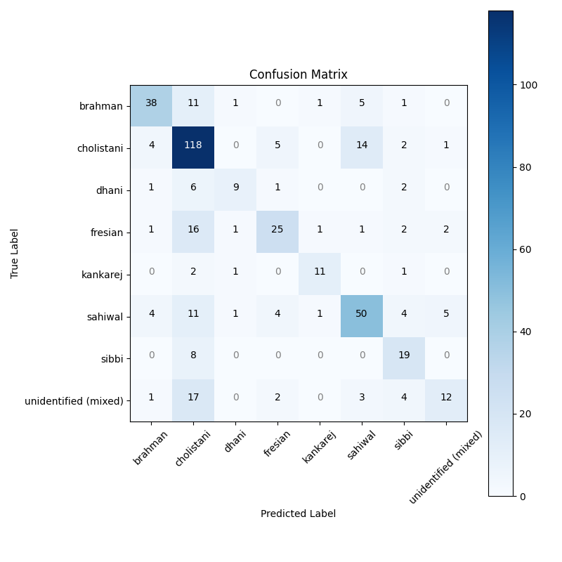

# ✨ Klasifikasi Otomatis Jenis Ternak Sapi dengan ResNet50 dan MobileNetV2 ✨

  

## Deskripsi Proyek

Proyek ini bertujuan untuk mengembangkan model pembelajaran mesin yang mampu mengklasifikasikan jenis sapi berdasarkan fitur-fitur tertentu. Proyek ini dirancang untuk membantu peternak, peneliti, dan pihak terkait dalam mengidentifikasi jenis sapi dengan lebih cepat dan akurat, sehingga dapat mendukung pengambilan keputusan dalam pengelolaan peternakan, pemuliaan, dan pemasaran ternak.

**Link Dataset yang digunakan:** [Cow Breed Classification Dataset](https://www.kaggle.com/datasets/zaidworks0508/cow-breed-classification-dataset).
Preprocessing yang digunakan antara lain Resizing, Normalization dan Augmentation.

Model yang digunakan: Pre Trained Model **_InceptionV3_** dan Pre Trained Model **_MobileNetV2_** dengan Architecture Model kurang lebih seperti gambar berikut.

**InceptionV3 Architecture** ✨

**MobileNetV2 Architecture** ✨

## Overview Dataset

Dataset yang digunakan adalah Dataset citra sapi. Dataset terdiri atas 2.167 data yang terbagi menjadi 70% sebagai Training Set, 20% sebagai Validation Set, dan 10% sebagai Testing Set, dimana pada setiap Set, terdapat 8 Label Class yaitu 'brahman', 'cholistani', 'dhani', 'fresian', 'kankarej', 'sahiwal', 'sibbi', 'unidentified (mixed)'.

## Langkah Instalasi

a. Model

1. Unduh Dataset yang akan digunakan
2. Run Script Settings To Extracted Dataset (Script.ipynb)
3. Run IPYNB
4. Save Kedua Model

b. Streamlit

1. Pdm add streamlit scikit-learn

install tensorflow dipdm
2. Pdm info -> pastikan sudah berada di .venv
3. Pdm run python -m pip show tensorflow -> cek tensorflow apakah sudah di .venv
4. Pdm run python -m ensurepip --upgrade
5. Pdm run python -m pip install tensorflow
6. Pdm run python -c "import tensorflow as tf; print(tf._version_)"

c. Deploy Streamlit Model

1. Upload All File Diluar Environtment PDM (.gitignore)
2. Deploy dan Bake melalui streamlit dengan terhubung dengan github[Dokumentasi Streamlit](https://docs.streamlit.io/)
3. Run dengan address deployment dengan akhiran **.io**

## Deskripsi : Model, Hasil, Analisis
**Preprocessing**

- Generator training menggunakan ImageDataGenerator untuk memuat dan memproses gambar dari direktori yang ditentukan.
- Gambar diubah ukurannya menjadi 224x224 piksel dengan batch size 64.
- Augmentasi data diterapkan pada gambar training dengan langkah-langkah berikut:
    - Zoom 
    - Translasi
    - Brightness
    - Contrast
- Konfigurasi ini memungkinkan model untuk belajar dari berbagai variasi gambar selama training, sementara preprocessing untuk evaluasi tetap konsisten.

### InceptionV3: Modelling & Evaluation ✨
Model ini menggunakan InceptionV3 sebagai base model yang telah dilatih dengan ImageNet dan dibekukan untuk tahap awal transfer learning. Arsitektur ini ditambahkan lapisan kustom seperti Global Average Pooling, Batch Normalization, beberapa lapisan dense dengan aktivasi ReLU, dan Dropout untuk mencegah overfitting. Lapisan output memiliki jumlah unit sesuai dengan jumlah kelas yang ingin diklasifikasikan menggunakan fungsi aktivasi Softmax.

Total parameter: 23,851,784, dengan 536,960 parameter dapat dilatih. Konfigurasi ini memanfaatkan keunggulan InceptionV3 untuk ekstraksi fitur dan lapisan tambahan dilatih untuk klasifikasi yang lebih spesifik.

Berikut hasil dari Model setelah dilakukan Fine-Tuning menggunakan dataset : 

a. Plot akurasi menunjukkan bahwa training accuracy meningkat secara bertahap hingga mendekati 90%, sementara validation accuracy tetap lebih rendah dan fluktuatif, berkisar di sekitar 70%. Hal ini mengindikasikan bahwa model dapat belajar dari data pelatihan tetapi menghadapi kesulitan dalam generalisasi pada data validasi.

b. Plot loss menunjukkan bahwa training loss menurun secara signifikan dari sekitar 2.5 ke nilai mendekati 0.5, sementara validation loss justru meningkat secara bertahap setelah beberapa epoch awal. Pola ini menunjukkan bahwa model mungkin mengalami overfitting, di mana model menjadi terlalu cocok dengan data pelatihan namun performanya menurun pada data validasi.

Laporan klasifikasi menunjukkan bahwa model memiliki akurasi keseluruhan sebesar 66%. Kinerja terbaik terlihat pada kelas Kankarej dengan F1-score 0.76, sementara kinerja terburuk terjadi pada kelas Unidentified (mixed) dengan F1-score 0.41 karena recall yang sangat rendah (0.31). Cholistani memiliki recall tertinggi (0.82), tetapi precision-nya lebih rendah (0.62). Sebaliknya, kelas seperti Dhani dan Fresian memiliki F1-score yang rendah (0.56 dan 0.58) karena kesulitan model dalam mengenali sampel dari kelas ini. Rata-rata macro F1-score adalah 0.63, yang menunjukkan bahwa model memiliki performa yang tidak konsisten antar kelas, sementara weighted average F1-score 0.65 mengindikasikan hasil yang lebih baik untuk kelas dengan lebih banyak data.

### MobileNetV2 : Modelling & Evaluation✨

Model ini menggunakan MobileNetV2 yang telah dilatih dengan ImageNet sebagai ekstraktor fitur, dengan lapisan kustom seperti Global Average Pooling, Batch Normalization, dua lapisan Dense (128 dan 64 unit, ReLU), dan lapisan output Softmax untuk klasifikasi multi-kelas. Total params: 2,786,458 (10.63 MB), Trainable params: 175,304 (684.78 KB), Non-trainable params: 2,260,544 (8.62 MB), Optimizer params: 350,610 (1.34 MB). Model ini dioptimalkan menggunakan Adam dengan learning rate 0.001 dan loss function categorical crossentropy.

Berikut hasil dari Model setelah dilakukan Fine-Tuning menggunakan dataset tersebut:

a. Plot akurasi menunjukkan bahwa training accuracy meningkat hingga mendekati 100%, sementara validation accuracy stagnan di sekitar 60-70% dengan sedikit fluktuasi. Hal ini menunjukkan bahwa model belajar dengan baik pada data pelatihan tetapi kesulitan dalam generalisasi terhadap data validasi.

b. Plot loss menunjukkan bahwa training loss menurun drastis dari sekitar 2.5 ke nilai mendekati 0.1, sedangkan validation loss mulai meningkat secara bertahap setelah beberapa epoch awal. Pola ini menunjukkan adanya overfitting, di mana model terlalu menyesuaikan data pelatihan sehingga kinerjanya memburuk pada data validasi.

Laporan klasifikasi menunjukkan bahwa model memiliki akurasi keseluruhan sebesar 68%. Kinerja terbaik terlihat pada kelas Kankarej dengan F1-score 0.75, sementara kinerja terburuk terjadi pada kelas Dhani dengan F1-score 0.59 karena recall yang rendah (0.53). Cholistani memiliki performa yang baik dengan F1-score 0.74, didukung oleh recall tertinggi (0.75). Sebaliknya, kelas seperti Fresian dan Sibbi memiliki F1-score yang moderat (0.63), menunjukkan kesulitan model dalam mengenali sampel dari kelas ini. Rata-rata macro F1-score adalah 0.66, menunjukkan variasi performa antar kelas, sementara weighted average F1-score sebesar 0.68 mencerminkan hasil yang lebih baik untuk kelas dengan jumlah data lebih besar.

## Author 👨‍💻

- [@Ashurinnn123](https://github.com/Ashurinnn123)
